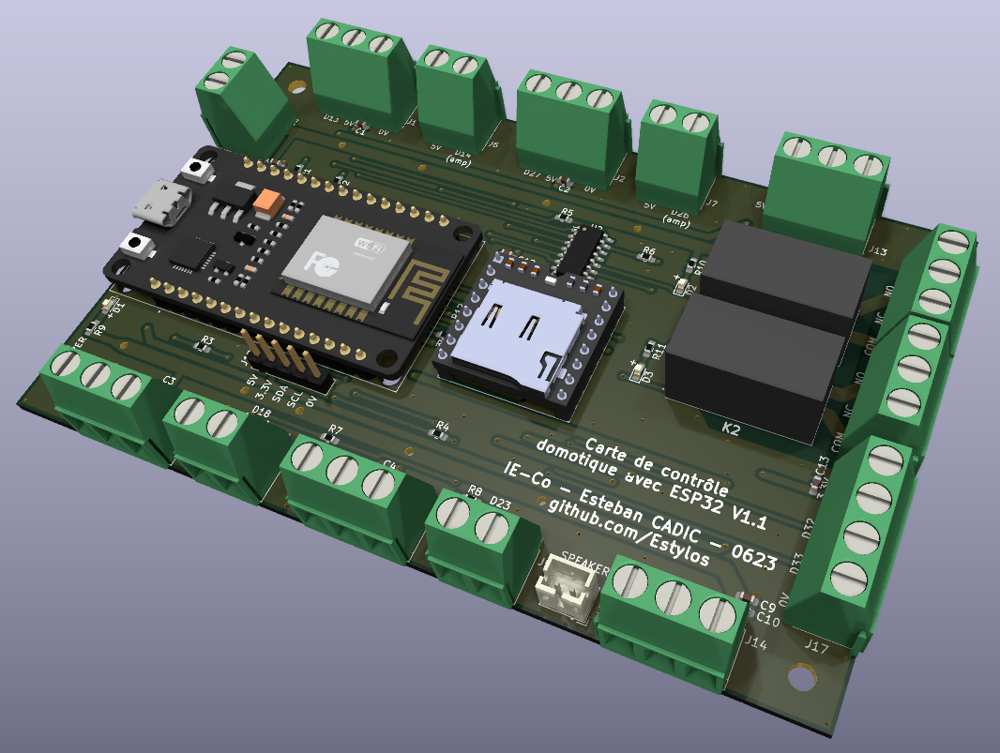
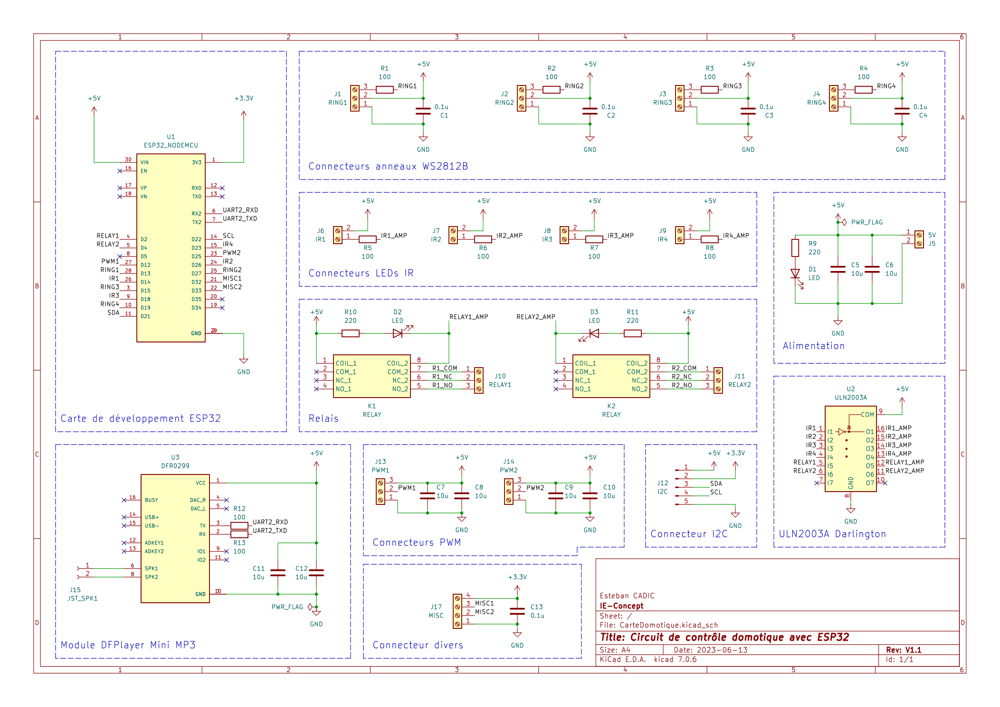

# Carte de contrôle domotique avec ESP32

Ce projet prend place dans le cadre de mon stage de fin de 1ère année de cycle ingénieur à l'école Grenoble INP - Esisar, effectué dans le bureau d'études en conception électronique [IE-Concept](https://www.ie-concept.fr/). Un grand merci à l'entreprise de m'avoir permis d'effectuer ce stage dans d'excellentes conditions ainsi que d'autoriser la publication du travail que j'ai pu mener.

## Présentation

L'objectif de ce stage consistait à l'installation d'un système domotique permettant de contrôler les climatiseurs de la société, ainsi que monitorer différents capteurs (température, humidité, présence…) le tout depuis Home Assistant. Ce repo contient seulement la carte électronique basée sur un ESP32 DevKit V1, réalisé sur KiCad ainsi que son boîtier modélisé sur Fusion 360.  

## Objectifs de la carte

La carte domotique conçue permet le branchement de 4 rubans ou anneaux de LEDs adressables WS2812 (pour l'indication lumineuse allant avec le contrôle des clims), 4 LEDs infrarouges, 2 sorties PWM, 1 sortie I2C, 2 relais, 1 port divers avec deux sources de tension (5 et 3.3V) et 2 GPIOs (utilisables par l’ADC1 de l’ESP32). La carte permet aussi le branchement d'un DFPlayer Mini et d'un haut-parleur servant à la lecture de sons depuis une carte SD (et pilotable par Home Assistant).

L'ESP32 peut être configuré directement avec ESPHome, permettant une intégration directe avec Home Assistant. 

## Circuit

Le circuit n'est pas d'une grande complexité. Il s'agit globalement d'un ESP32 avec des borniers à vis, 2 relais, un DFPlayer et quelques composants passifs : condensateurs pour le découplage et résistances pour la limitation de courant. Un réseau de transistors Darlington (ULN2003A) est utilisé afin d'amplifier et de monter à 5V les sorties des LEDs infrarouges contrôlant les climatiseurs et les sorties pour les 2 relais.
